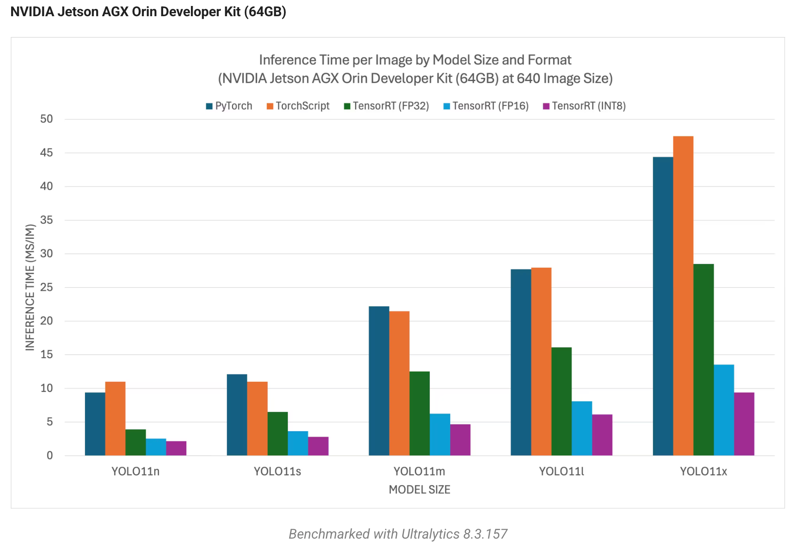
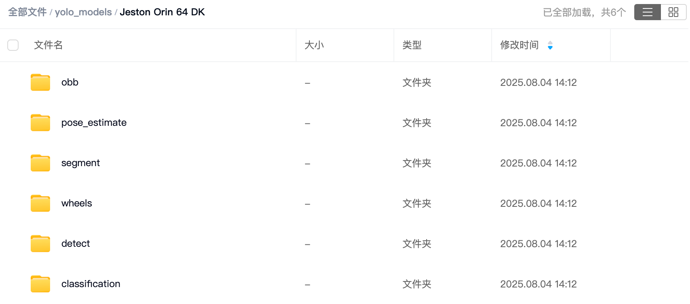
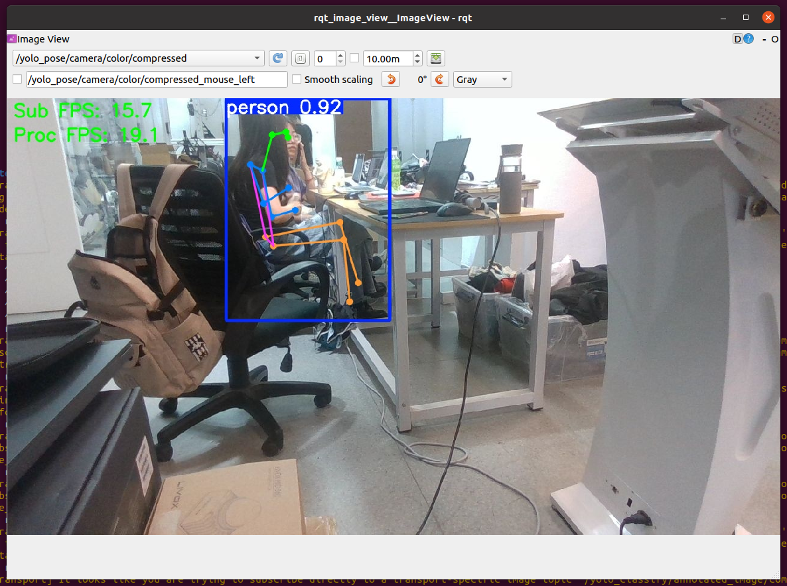

# Jetson Yolo ROS

This package runs the Yolov11 model on `Nvidia Orin` and includes five basic function nodes: target detection, semantic segmentation, image classification, pose estimation, and OBB calculation.

The following are blogs and links for reference in this repository:

* Ultralytics：[https://github.com/ultralytics/ultralytics](https://github.com/ultralytics/ultralytics)
* Ultralytics Nvidia Jetson：[https://docs.ultralytics.com/guides/nvidia-jetson/#install-pytorch-and-torchvision_1](https://docs.ultralytics.com/guides/nvidia-jetson/#install-pytorch-and-torchvision_1)

[Note] If your device is a brand new Nvidia Orin, we recommend that you refer to the following blog to flash the device and follow the `[15. [Optional] Install Yolo11 and DeepStream]` section to complete the installation. In this way, you can skip the `[Install and Configure Ultralytics]` section below.

* Nvidia Orin DK Flashing：[https://blog.csdn.net/nenchoumi3119/article/details/149779298?spm=1001.2014.3001.5502](https://blog.csdn.net/nenchoumi3119/article/details/149779298?spm=1001.2014.3001.5502)

<font color=red>**It is recommended to install conda in your environment to manage Python virtual environments.**</font>

The compiled model and some wheel resources can be downloaded from the network disk through the following links:

```txt
https://pan.baidu.com/s/1pxzS423gZaWbsfSmpQGrsQ?pwd=24wj
```

-----
# Software and Hardware confirmation

Please first confirm whether your software and hardware configuration is consistent with the tested list:

|Device|OS|Platform|JetPack|CUDA|OpenCV|ROS|
|--|--|--|--|--|--|--|
|Nvidia Orin 64 GB DK|Ubuntu 20.04|Arm64|5.1.3|11.4.315|4.5.4 with CUDA|Noetic|

The [NVIDIA Jetson AGX Orin Developer Kit (64GB)](https://docs.ultralytics.com/guides/nvidia-jetson/#nvidia-jetson-agx-orin-developer-kit-64gb) section on the Ultralytics official website provides a performance comparison table for different models. This table can be used as a basis for checking whether the environment is configured correctly. If your final results differ significantly from this table, please check whether your CUDA and TensorRT are configured correctly:



Check the current CUDA and TensorRT versions using the following command:

```bash
$ jetson_release
```


----
# Step 1. Install and configure Ultralytics

If you haven't installed the Ultralytics environment before, you should first perform the following steps. If you have already deployed the Ultralytics environment locally, you can skip this section, but you need to make sure that `torch`, `torchvision`, and `onnxruntime` in your environment are GPU-accelerated versions. Check with the following command (assuming your conda environment is named `yolo11`):

```bash
(base) $ conda activate yolo11
(yolo11) $ pip list | grep -E "torch|onnxruntime"
(yolo11) $ python -c "import torch; print(f'CUDA available: {torch.cuda.is_available()}')"
```


## 1.1 Pull the source code and install dependencies

Use the following command to pull the source code:

```bash
$ git clone https://github.com/ultralytics/ultralytics.git
```

Use the following command to install the dependency library:

```bash
$ sudo apt-get install libgstreamer1.0-0 gstreamer1.0-tools gstreamer1.0-plugins-good 
$ sudo apt-get install gstreamer1.0-plugins-bad gstreamer1.0-plugins-ugly 
$ sudo apt-get install gstreamer1.0-libav libgstreamer-plugins-base1.0-dev 
$ sudo apt-get install libgstrtspserver-1.0-0 libjansson4 libyaml-cpp-dev
```

## 1.2 Creating a virtual environment

It is recommended to use the `Python 3.8` version of the interpreter here, because the torch and torchvision wheels with CUDA acceleration compiled by Nvidia are available. Other versions of the interpreter may need to compile these two libraries yourself;

```bash
(base) $ conda create -n yolo11 python=3.8 -y
(base) $ conda activate yolo11
(yolo11) $ cd ultralytics
```

Initialize the virtual environment using the following command in the ultralytics directory:

```bash
(yolo11) $ pip install -e ".[export]" onnxslim
(yolo11) $ pip install opencv-python libffi==3.3
```

Use the following command to replace some libraries with CUDA accelerated versions:

```bash
(yolo11) $ pip uninstall torch torchvision onnxruntim numpy

# Install numpy
(yolo11) $ pip install numpy==1.23.5

# Install onnxruntime_gpu
(yolo11) $ wget https://nvidia.box.com/shared/static/zostg6agm00fb6t5uisw51qi6kpcuwzd.whl -O onnxruntime_gpu-1.17.0-cp38-cp38-linux_aarch64.whl
(yolo11) $ pip install onnxruntime_gpu-1.17.0-cp38-cp38-linux_aarch64.whl

# Install torch
(yolo11) $ pip install https://github.com/ultralytics/assets/releases/download/v0.0.0/torch-2.2.0-cp38-cp38-linux_aarch64.whl

# Install torchvision
(yolo11) $ pip install https://github.com/ultralytics/assets/releases/download/v0.0.0/torchvision-0.17.2+c1d70fe-cp38-cp38-linux_aarch64.whl
```

## 1.3 Verify the virtual environment
Use the following command to verify that the virtual environment is successfully configured. You should see the `CUDA available: True` field.

```bash
$ python -c "import torch; print(f'CUDA available: {torch.cuda.is_available()}')"
```

----
# Step 2. Pull the project source code and compile it

## 2.1 Pull the source code

First, enter your ROS workspace, assuming it's `detect_ws`:

```bash
$ cd detect_ws/src
$ git clone --recursive https://github.com/GaohaoZhou-ops/JetsonYoloROS.git
```

## 2.2 Modifying the realsense-ros Source Code

To fully utilize the acceleration potential of OpenCV-CUDA, some source code in realsense-ros needs to be modified:


```bash
$ cd detect_ws/src/JetsonYoloROS/realsense-ros
$ git checkout ros1-legacy
$ cd realsense2_camera
```

Open the `CMakeLists.txt` file and add the following content:


```cmake
find_package(OpenCV REQUIRED)               # Add OpenCV package
find_package(catkin REQUIRED COMPONENTS
    message_generation
    nav_msgs
    roscpp
    sensor_msgs
    std_msgs
    std_srvs
    nodelet
    cv_bridge
    image_transport
    tf
    ddynamic_reconfigure
    diagnostic_updater
    OpenCV REQUIRED                         # Add OpenCV dependence
    )

...

set(CMAKE_NO_SYSTEM_FROM_IMPORTED true)
include_directories(
    include
    ${realsense2_INCLUDE_DIR}
    ${catkin_INCLUDE_DIRS}
    ${OpenCV_INCLUDE_DIRS}                  # Add OpenCV head file path
    )

...

target_link_libraries(${PROJECT_NAME}
    ${realsense2_LIBRARY}
    ${catkin_LIBRARIES}
    ${CMAKE_THREAD_LIBS_INIT}
    ${OpenCV_LIBRARIES}                     # Add OpenCV libraries
    )

```

---
## 2.3 Compiling the Project

Before compiling the project, ensure you have exited the conda environment and returned to your project directory:


```bash
(base) $ conda deactivate
$ cd detect_ws

$ catkin_make

...
[ 86%] Built target yolo_detect_generate_messages_cpp
[ 80%] Built target yolo_detect_generate_messages_nodejs
[ 89%] Built target yolo_detect_generate_messages_py
[ 95%] Built target yolo_detect_generate_messages_eus
[100%] Built target realsense2_camera
[100%] Built target yolo_detect_generate_messages
```

## 2.4 Adding Script Permissions

Use the following command to add executable permissions to the Python script in the project:

```bash
$ cd detect_ws
$ chmod +x src/yolo_detect/scripts/*
```

---
# Step 3. Obtain the Model

Two methods are provided for obtaining models compatible with the Jetson device platform. You can download from a network drive or compile locally, but the second method, local compilation, is recommended as it maximizes hardware acceleration performance.

## 3.1 [Quick] Download from a Network Drive

Open the following link to find the model for your device. Currently, only the Jetson AGX Orin 64GB DK hardware is supported. Model files for other Jetson platforms will be added in the future:

```txt
https://pan.baidu.com/s/1pxzS423gZaWbsfSmpQGrsQ?pwd=24wj
```




## 3.2 [Recommended] Download and Compile the Model

Create a script named `download.py` in your Ultralytics installation directory and add the following content. Assume the model you want to download is `yolo11l-obb`. For more Yolo model branches, see the official Github documentation:

* Yolo model branches: [https://github.com/ultralytics/ultralytics?tab=readme-ov-file#-models](https://github.com/ultralytics/ultralytics?tab=readme-ov-file#-models)

[Note]: The `sys.path.append('/usr/lib/python3.8/dist-packages/')` line in the code must be present; otherwise, an error will occur.**</font>

```python
from ultralytics import YOLO
import sys
sys.path.append('/usr/lib/python3.8/dist-packages/')

import time

model = YOLO("yolo11l-obb.pt")          # check your model name
model.export(format="engine")  
trt_model = YOLO("yolo11l-obb.engine")  # check your model name
results = trt_model("https://ultralytics.com/images/bus.jpg")
```

## 3.3 Moving the Model
After downloading, move the model file to the `yolo_detect/models` directory, as shown below:

```bash
(base) orin@ubuntu:~/detect_ws/src/yolo_detect$ tree
...
├── models
│   ├── yolo11l.engine      # Downloaded models
│   ├── yolo11l.onnx
│   └── yolo11l.pt
├── msg
...
```

----
# Step 4. Run the Examples

Before running any examples, first start the RealSense camera:

```bash
$ cd detect_ws
$ source devel/setup.bash 
$ roslaunch realsense2_camera rs_rgbd.launch 
```

## 4.1 Object Detection

```bash
$ conda activate yolo11
$ cd detect_ws
$ source devel/setup.bash 
$ roslaunch yolo_detect 2d_detect.launch
```


## 4.2 Object Segmentation

```bash
$ conda activate yolo11
$ cd detect_ws
$ source devel/setup.bash 
$ roslaunch yolo_detect 2d_segmentation.launch
```


## 4.3 OBB

```bash
$ conda activate yolo11
$ cd detect_ws
$ source devel/setup.bash 
$ roslaunch yolo_detect 2d_obb.launch
```


## 4.4 Image Classification

```bash
$ conda activate yolo11
$ cd detect_ws
$ source devel/setup.bash 
$ roslaunch yolo_detect 2d_classification.launch
```


## 4.5 Pose Estimation

```bash
$ conda activate yolo11
$ cd detect_ws
$ source devel/setup.bash 
$ roslaunch yolo_detect 2d_pose_estimate.launch
```




----
# Possible Problems and Solutions

The following are some possible problems you might encounter while implementing this project, along with their corresponding solutions.